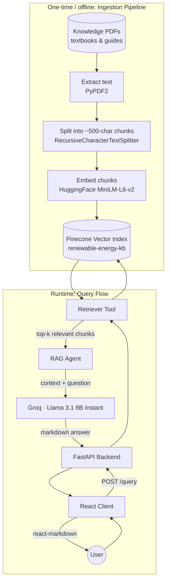
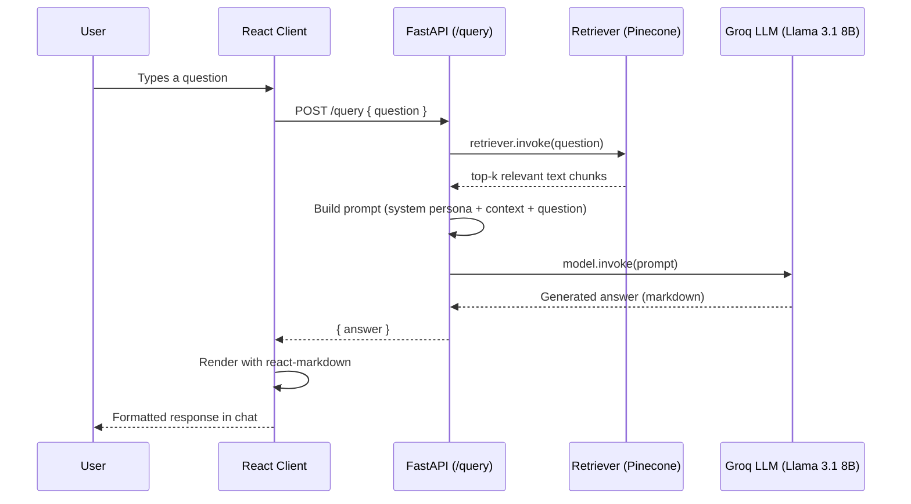

# GreenGenie — Renewable Energy Awareness Chatbot

GreenGenie is a Retrieval-Augmented Generation (RAG) chatbot that answers questions about renewable energy, grounded in a curated knowledge base of textbooks and guides rather than the model's raw training data alone. Built as a group project for the **1M1B initiative** by team **JoJo Coders**.

---

## What it does

Ask GreenGenie anything about renewable energy — solar, wind, hydro, policy, technology — and it:

1. Searches a vector database of ingested reference material for relevant passages
2. Feeds those passages, along with your question, to an LLM
3. Returns a grounded, markdown-formatted answer rendered natively in the chat UI

If nothing relevant is found in the knowledge base, GreenGenie falls back to the model's general knowledge rather than refusing — it's tuned to always be helpful, at the cost of not every answer being strictly citation-grounded (see [Design notes](#design-notes)).

---

## Architecture



### Query request flow



---

## Repo layout

```
.
├── app.py                      # FastAPI app — single endpoint: POST /query
├── config.py                   # Loads API keys from environment
├── schemas/query.py            # Request schema (Pydantic)
├── rag/
│   ├── agent.py                 # Orchestrates retrieval + generation
│   ├── retriver.py              # Wraps the vectorstore as a retriever tool
│   └── vectorstore.py           # Pinecone vectorstore connection
├── embeddings/embedding.py     # HuggingFace embedding model config
├── llm/
│   ├── groq.py                  # Groq (Llama 3.1 8B) — active model
│   └── gemini.py                # Gemini — configured, currently unused
├── prompts/system_prompt.py    # GreenGenie persona + answering rules
├── ingestion/
│   ├── text_processing.py       # PDF text extraction + chunking
│   ├── pineconedb.py             # Creates the Pinecone index
│   └── build_index.py            # Runs the full ingestion pipeline
├── knowledge_sources_pdfs/     # Source material (textbooks, guides)
└── Client/                     # React frontend (see below)
```

---

## The client

`Client/` is the React + Vite frontend, contributed and maintained as part of this same team project.

**My contribution:** wiring up `react-markdown` (`ChatMessage.jsx`) so that the LLM's markdown-formatted responses — headers, bold text, bullet lists — render properly in the chat UI instead of showing up as raw `**text**` / `- item` syntax.

| Piece | Purpose |
|---|---|
| `pages/HomePage.jsx`, `AboutPage.jsx`, `ChatbotPage.jsx` | Route-level pages |
| `components/ChatMessage.jsx` | Renders one message bubble, markdown-parsed |
| `components/Suggestions.jsx` | Suggested starter questions |
| `components/RenewableCard.jsx` | Info cards on the home/about pages |
| `Services/api.js` | Calls the FastAPI `/query` endpoint |
| `hooks/useRouter.js` | Lightweight client-side routing |

---

## Tech stack

| Layer | Tech |
|---|---|
| Frontend | React 19, Vite, Tailwind CSS, react-markdown, lucide-react |
| Backend | FastAPI, Pydantic |
| Orchestration | LangChain |
| Embeddings | HuggingFace `sentence-transformers/all-MiniLM-L6-v2` (384-dim) |
| Vector store | Pinecone (serverless, AWS `us-east-1`, cosine similarity) |
| LLM | Groq — Llama 3.1 8B Instant |
| PDF parsing | PyPDF2 |

---

## Running locally

**Backend**
```bash
pip install -r requirements.txt

# .env
GOOGLE_API_KEY=...
HF_API_KEY=...
PINECONE_API_KEY=...
GROQ_API_KEY=...

uvicorn app:app --reload
```

**Build the knowledge base** (first run only, or whenever `knowledge_sources_pdfs/` changes):
```bash
python -m ingestion.build_index
```

**Frontend**
```bash
cd Client
npm install
echo "VITE_API=http://127.0.0.1:8000" > .env
npm run dev
```

---

## Design notes

- **Always-answer policy.** The system prompt explicitly instructs the model to never refuse and to draw on general knowledge when retrieved context is insufficient. This favors availability over strict grounding — answers aren't always traceable to a retrieved source, and worth knowing if you need citation-level accuracy.
- **Chunking:** 500 characters with 100-character overlap, split recursively on paragraph/sentence boundaries.
- **Retrieval:** top-k = 4 chunks per query.
- **Gemini is configured but unused** — `llm/gemini.py` exists as a ready alternative to Groq but isn't currently wired into `rag/agent.py`.

---

## Team — JoJo Coders (1M1B Project)

- Vijaya Vardhan Killi
- Davud Shaik
- MD Chisty Madeena Sharieff
- Rajesh Mummidi

---

## Contributing

Issues and PRs welcome.
